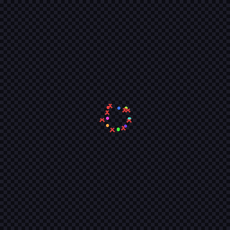
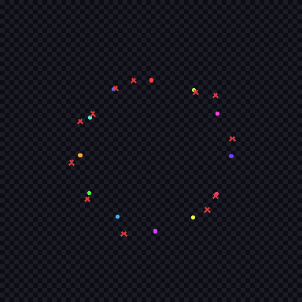

# FLOW



**FLOW v0.1** — Image-as-Vector-Field Esolang VM.

El programa **ES una imagen** (PNG). Los canales R/G codifican un campo vectorial
continuo; el canal B codifica datos + instrucciones. Partículas fluyen por el
campo, ejecutando instrucciones al muestrear el canal B bajo su posición.

## Instalación

```bash
pip install -e .
```

Requiere: `pillow>=10`, `numpy>=1.24` (Python 3.10+).

## Ejecución

```bash
# Generar ejemplos
flow run examples/hello_flow.png --max-ticks 200 --seed 42 --trace trace.json
flow run examples/vortex.png --max-ticks 500 --seed 42 --trace trace.json

# Replay determinista (verifica reproducción exacta)
flow replay examples/vortex.png --trace trace.json --output-trace trace_replay.json

# Comparar traces (proyección semántica)
flow trace-diff trace.json trace_replay.json

# Validar schema de trace
flow validate trace.json
```

## Multiple views, one execution

FLOW separates what happened from how it is shown.

```
program.png → FlowVM → ExecutionTrace.json → renderer profile → GIF
```

The VM runs once. The trace is saved. Then you render it as many ways
as you like, each time producing a different **visual projection** of
the same execution.

```bash
# Same trace, different views
flow render trace.json --profile debug     --output debug.gif
flow render trace.json --profile trails    --output trails.gif
flow render trace.json --profile heatmap   --output heatmap.gif
flow render trace.json --profile graph     --output graph.gif
flow render trace.json --profile orbit     --output orbit.gif
flow render trace.json --profile cinematic --output cinematic.gif

# Story mode requires a render-spec.json
flow render trace.json --profile story --spec render-spec.json --output story.gif
```

**Canonical invariant:** `TRACE != VIEW`. Both GIFs come from the same
ExecutionTrace. Rendering never re-executes the VM.

| Profile | Description |
|---------|-------------|
| `debug` | Original arena view (evidence / inspection) |
| `trails` | Fading trail segments + event pulses + interpolation |
| `heatmap` | Accumulated cell activity from real events |
| `graph` | Event type transition graph, circle layout |
| `orbit` | Abstract entity layout with event pulses |
| `story` | Spec-driven labeled entities + caption bar |
| `cinematic` | Glow + interpolation + trails + persistence |

## Determinismo

- `--seed` controla `RAND` (instr 22). Mismo programa + misma seed = trace **idéntico**.
- Sin `RAND` ejecutado: distintas seeds producen trace **idéntico**.
- Con `RAND` ejecutado: distintas seeds producen traces **diferentes**.
- `replay` re-ejecuta y compara con `trace-diff` (proyección semántica: seed excluida).
- **Render determinism:** same trace + same profile + same spec → same GIF bytes (`BYTE_DETERMINISTIC`).

## Salidas legacy (opcionales)

`--output prefix` genera:
- `prefix_b.png` — campo B final
- `prefix_trace.png` — capa TRACE (si se usó instr 24)
- `prefix.csv` — log tick-by-tick

## Tests

```bash
python -m pytest tests/ -v
```

42 tests: 8 unitarios del VM + 8 de determinismo M1 + 8 de render M2 + 18 de perfiles M3.

## Ejemplos incluidos

| Archivo | Descripción |
|---------|-------------|
| `examples/hello_flow.png` | Partícula fluye derecha, INC×5 → WRITE → HALT |
| `examples/vortex.png` | 8 partículas en vórtice con SPLIT + TRACE |

## Arquitectura

```
flow.core      # VM pura (FlowVM, Particle, instrucciones)
    ↓
flow.runtime   # ExecutionTrace (observación pura, sin re-ejecutar lógica)
    ↓
flow.cli       # run / replay / trace-diff / validate / render
    ↓
flow.render    # M2: image/gif/session renderers
               # M3: profiles (debug/trails/heatmap/graph/orbit/story/cinematic)
                   consume ExecutionTrace + RenderSpec → frames → GIF
```

## License

Dominio público / CC0.

---

### FlowGen → FLOW pipeline demo



*Pipeline: `flowgen visualize FLOW → program.flow → execution.trace.json → flow render --format gif`*
